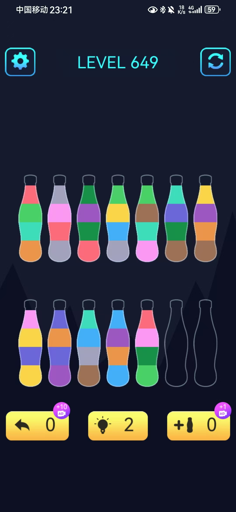

# 颜色拼接

在应用商场找到一款小游戏，名字叫颜色拼接，是一款益智类游戏，游戏的规则是通过倾倒瓶子将颜色相同的液体拼在一起。游戏界面如下：

于是本人想通过代码找到游戏的答案，因此有了本项目。

## 使用方法

~~~cmd
python color_stitching.py --input_file input.txt --output_file output.txt
~~~

### 输入文件格式

输入文件为文本文件，每行表示一个瓶子，每个瓶子的颜色用空格空开，从左到右为瓶子从底到上的顺序。

### 输出文件格式

输出文件为文本文件，每行为一个步骤，表示从第几个瓶子倾倒到第几个瓶子。瓶子计数从0开始。

## 注：

本人水平有限，只采用暴搜的方法，对于简单样例可以实现，但是对于复杂情境，可能会超时。同时目前的解法存在无效步骤，并不是最优情况。